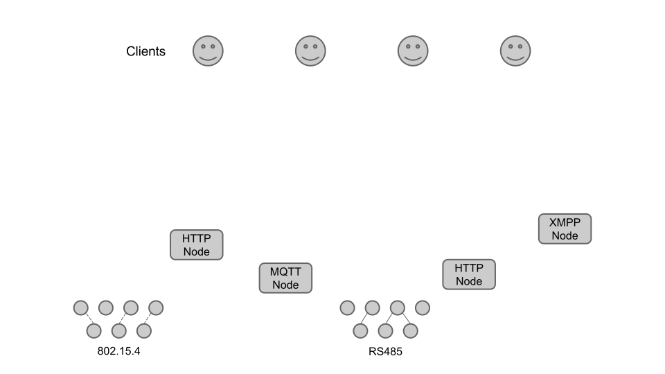
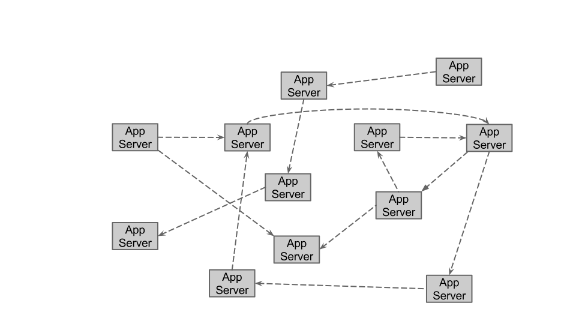
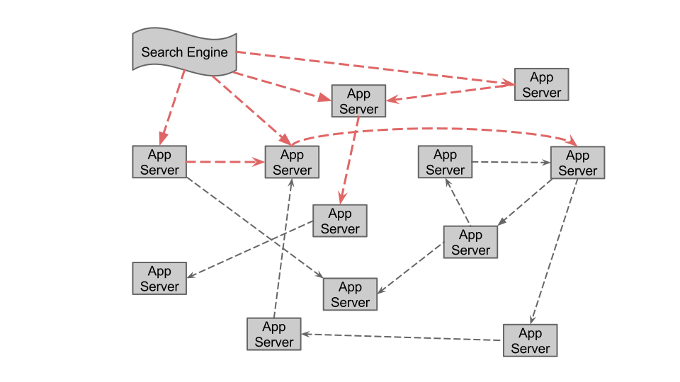
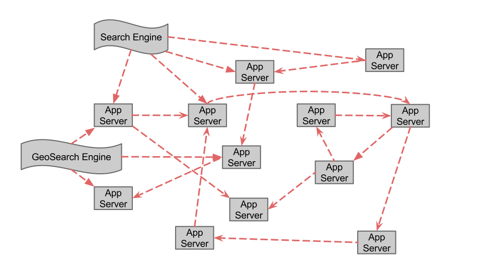

## Hypermedia APIs for Sensor Data
### A pragmatic approach to the Web of Things
#### Mobiquitous 2014

---

## Spencer Russell Joe Paradiso
### MIT Media Lab
### Responsive Environments Group

---

## Big Picture

* global scale
* not meant to replace low-power protocols
* build on web technologies
* leverage existing infrastructure and talent

---

### Low-Level Protocol Diversity
### Layered Architecture
### Hyperlinks
### Shared Vocabularies
### Semantic Relations
### Familiar Standards, Minimal Tooling
### Pub/Sub

---

### Low-Level Protocol Diversity
### Layered Architecture {class="dim"}
### Hyperlinks {class="dim"}
### Shared Vocabularies {class="dim"}
### Semantic Relations {class="dim"}
### Familiar Standards, Minimal Tooling {class="dim"}
### Pub/Sub {class="dim"}

* Assume a plurality of low-level device protocols

---

* abstract them from clients

---

---

### Low-Level Protocol Diversity {class="dim"}
### Layered Architecture
### Hyperlinks {class="dim"}
### Shared Vocabularies {class="dim"}
### Semantic Relations {class="dim"}
### Familiar Standards, Minimal Tooling {class="dim"}
### Pub/Sub {class="dim"}

* allowing intermediaries
* handle caching, authentication, and encryption

---

---

---

---

* so this is in many ways what is common now
* app servers not speaking same language
* no standard way for them to connect to each other
* still better because of the layers

---

### Low-Level Protocol Diversity {class="dim"}
### Layered Architecture {class="dim"}
### Hyperlinks
### Shared Vocabularies {class="dim"}
### Semantic Relations {class="dim"}
### Familiar Standards, Minimal Tooling {class="dim"}
### Pub/Sub {class="dim"}

* present resource relations
* affordances(creating a device, sending a command)
* currently using JSON-HAL, but JSON-LD looks nice as well
* Going to spend a little time here, as it's important!

---

* now with hyperlinks

---

* And now lets focus on the application servers

---

* But say we have a lot more application servers

---

* so now we have something that looks a lot like the early-90s web
* now what came along in 1994 to help consumers find what they wanted

---

---

---

* the web is a substrate for innovation, an ecosystem we can grow new services
  on top of

---

* now that we have all these links, what do they mean?...

---

### Low-Level Protocol Diversity {class="dim"}
### Layered Architecture {class="dim"}
### Hyperlinks {class="dim"}
### Shared Vocabularies
### Semantic Relations {class="dim"}
### Familiar Standards, Minimal Tooling {class="dim"}
### Pub/Sub {class="dim"}

* Support interoperability via shared vocabularies
* specifically focus on vocabulary of relation names and data types
* terms identified with URIs
* lightweight to extend

---

* Need vocab for relation types, data types
* HAL gives nice way to tie relations to URLs to identify and describe
* some (esp. search engines) are already using Schema.org data types

---

### Low-Level Protocol Diversity {class="dim"}
### Layered Architecture {class="dim"}
### Hyperlinks {class="dim"}
### Shared Vocabularies {class="dim"}
### Semantic Relations
### Familiar Standards, Minimal Tooling {class="dim"}
### Pub/Sub {class="dim"}

* enabled by hyperlinks and shared vocabulary
* Provide semantic relationships
* Probably not necessary to tie in to Upper Ontology
* don't require full Semantic Web buy-in from developers

---

### Low-Level Protocol Diversity {class="dim"}
### Layered Architecture {class="dim"}
### Hyperlinks {class="dim"}
### Shared Vocabularies {class="dim"}
### Semantic Relations {class="dim"}
### Familiar Standards, Minimal Tooling
### Pub/Sub {class="dim"}

* use familiar standards (HTTP, JSON, and WebSockets)
* no specialized tooling or libraries

---

    {
        "firstName": "Spencer",
        "lastName": "Russell"
    }

* raw JSON doesn't give us QUITE enough
* we still need hyperlinks and shared vocabulary

---

    {
        "_links": {
            "self": { "href": "/api/user/837" },
            "address": { "href": "/api/address/938" }
        },
        "firstName": "Spencer",
        "lastName": "Russell"
    }

* just JSON with links
* has a mechanism for the relation name to be a URL, but I won't go into it here
* this gives us everything we need

---

### Low-Level Protocol Diversity {class="dim"}
### Layered Architecture {class="dim"}
### Hyperlinks {class="dim"}
### Shared Vocabularies {class="dim"}
### Semantic Relations {class="dim"}
### Familiar Standards, Minimal Tooling {class="dim"}
### Pub/Sub

* allow clients to subscribe to push updates

---

* use links to tell clients when streams are available

---

## Implementation

* reference implementation is in progress, but in use now
* basically everything except the shared vocabularies

---

* python
* django and flask
* postgres

---

### 490 Devices
### 2257 Sensors
### Over 240,000,000 measurements
### 6 applications

* devices using a variety of protocols
* applications: (2x unity, 2x glass, javascript web, SOOFA)
* common protocols are a lot easier in unique or niche environments (e.g. Unity)

---

Live
----

[http://chain-api.media.mit.edu](http://chain-api.media.mit.edu)

---

Open Source
-----------

[https://github.com/ssfrr/chain-api](https://github.com/ssfrr/chain-api)

## Spencer Russell
### sfr@media.mit.edu
### @ssfrr
### github.com/ssfrr

Security
--------

* admittedly security isn't a focus of my research
* brand-new security schemes scare me

---

---

