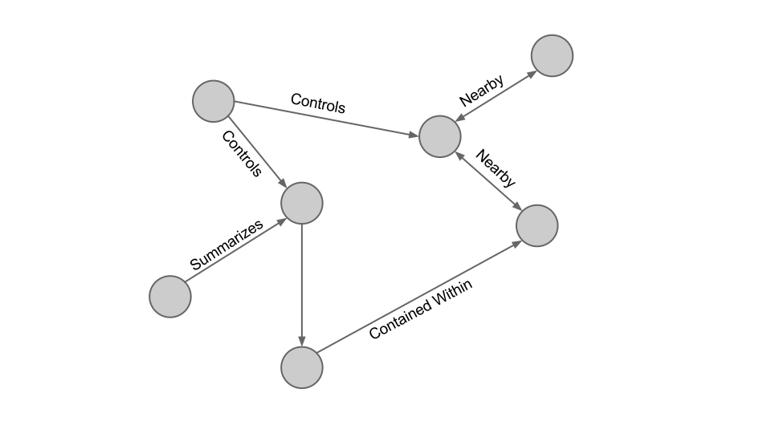

## Hypermedia APIs for Sensor Data
### A pragmatic approach to the Web of Things
#### Mobiquitous 2014

---

## Spencer Russell Joe Paradiso
### MIT Media Lab
### Responsive Environments Group

---

## Vision

* global scale
* not meant to replace low-power protocols
* build on web technologies
* leverage existing infrastructure and talent

---

---

---

---

---

* so this is in many ways what is common now
* app servers not speaking same language
* no standard way for them to connect to each other

---

* layered architecture, less scaling on massive connection loads and keepalive

---

### Low-Level Protocol Diversity
### Layered Architecture
### Hyperlinks
### Shared Vocabularies
### Familiar Standards, Minimal Tooling
### Semantic Relations
### Pub/Sub

---

### Low-Level Protocol Diversity
### Layered Architecture {class="dim"}
### Hyperlinks {class="dim"}
### Shared Vocabularies {class="dim"}
### Familiar Standards, Minimal Tooling {class="dim"}
### Semantic Relations {class="dim"}
### Pub/Sub {class="dim"}

* Assume a plurality of low-level device protocols
* abstract them from clients

---

### Low-Level Protocol Diversity {class="dim"}
### Layered Architecture
### Hyperlinks {class="dim"}
### Shared Vocabularies {class="dim"}
### Familiar Standards, Minimal Tooling {class="dim"}
### Semantic Relations {class="dim"}
### Pub/Sub {class="dim"}

* allowing intermediaries
* handle caching, authentication, and encryption

---

### Low-Level Protocol Diversity {class="dim"}
### Layered Architecture {class="dim"}
### Hyperlinks
### Shared Vocabularies {class="dim"}
### Familiar Standards, Minimal Tooling {class="dim"}
### Semantic Relations {class="dim"}
### Pub/Sub {class="dim"}

* present resource relations and client affordances

---

### Low-Level Protocol Diversity {class="dim"}
### Layered Architecture {class="dim"}
### Hyperlinks {class="dim"}
### Shared Vocabularies
### Familiar Standards, Minimal Tooling {class="dim"}
### Semantic Relations {class="dim"}
### Pub/Sub {class="dim"}

* Support interoperability via shared vocabularies
* terms identified with URIs

---

### Low-Level Protocol Diversity {class="dim"}
### Layered Architecture {class="dim"}
### Hyperlinks {class="dim"}
### Shared Vocabularies {class="dim"}
### Familiar Standards, Minimal Tooling
### Semantic Relations {class="dim"}
### Pub/Sub {class="dim"}

* use familiar standards (HTTP, JSON, and WebSockets)
* no specialized tooling or libraries

---

### Low-Level Protocol Diversity {class="dim"}
### Layered Architecture {class="dim"}
### Hyperlinks {class="dim"}
### Shared Vocabularies {class="dim"}
### Familiar Standards, Minimal Tooling {class="dim"}
### Semantic Relations
### Pub/Sub {class="dim"}

* Provide semantic relationships
* don't require full Semantic Web buy-in from developers

---

### Low-Level Protocol Diversity {class="dim"}
### Layered Architecture {class="dim"}
### Hyperlinks {class="dim"}
### Shared Vocabularies {class="dim"}
### Familiar Standards, Minimal Tooling {class="dim"}
### Semantic Relations {class="dim"}
### Pub/Sub

* allow clients to subscribe to push updates

---

Link Oriented
-------------

* Links represent possible actions the client can take
    * Creating a device
    * Sending a command
* Hypermedia, like the web, MESSY
* Built on json+hal

---

* Lets take a look back at our high-level architecture

---

* And now lets focus on the application servers

---

* But say we have a lot more application servers

---

* so now we have something that looks a lot like the early-90s web
* now what came along in 1994 to help consumers find what they wanted

---

---

---

* the web is a substrate for innovation, an ecosystem we can grow new services
  on top of

---

---

Security
--------

* admittedly security isn't a focus of my research
* brand-new security schemes scare me

---

---

Ontology
--------

---

* shared vocabulary is necessary for nice querying
* Probably not necessary to tie in to Upper Ontology
* Need vocab for relation types, data types
* HAL gives nice way to tie relations to URLs to identify and describe
* some (esp. search engines) are already using Schema.org data types

---

## Chain API

---

* 366 devices in the system using a variety of protocols
* 1121 separate sensors
* Over 100,000,000 measurements over about 6 months
* at least 6 applications (2x unity, 2x glass, javascript web, SOOFA)
* common protocols are a lot easier in unique or niche environments

Streaming
---------

---

---

Open Source
-----------

[https://github.com/ssfrr/chain-api](https://github.com/ssfrr/chain-api)

Live
----

[http://chain-api.media.mit.edu](http://chain-api.media.mit.edu)

