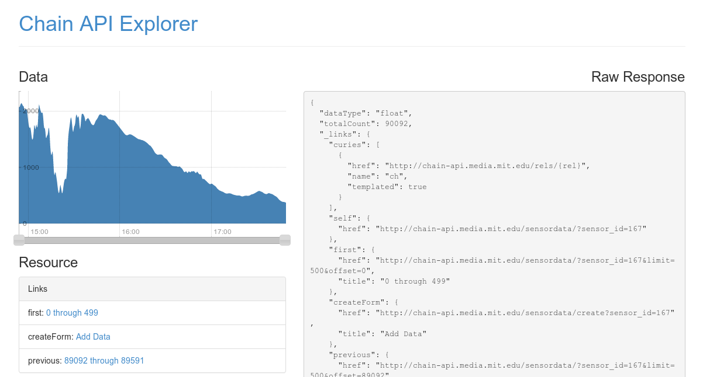

% Chain API
% Spencer Russell; MIT Media Lab
% 2014-04-23

---

## Sensor Architecture

---

---

---

Project Scope
-------------

---

---

---

* not about implementation specifics
* exploring API design
* tying together existing standards

Link Oriented
-------------

* Hypermedia
* Built on json+hal

---

---

Discoverable
------------

* Links represent possible actions the client can take
    * Creating a device
    * Sending a command
* Hypermedia
* Built on json+hal

Streaming
---------

---

---

Decentralized
-------------

* Modeled after the Web
* Seamlessly cross servers
* allow flexibility for implementations (though there's a balance)

---

---

Crawlable
---------

* moving forwards (future work)
* Leverage Search Engines
* Links represent relationships
* Search engines already taking advantage of semantic links in HTML (microdata)

---

Open Source
-----------

[https://github.com/ssfrr/chain-api](https://github.com/ssfrr/chain-api)

Live
----

[http://chain-api.media.mit.edu](http://chain-api.media.mit.edu)

