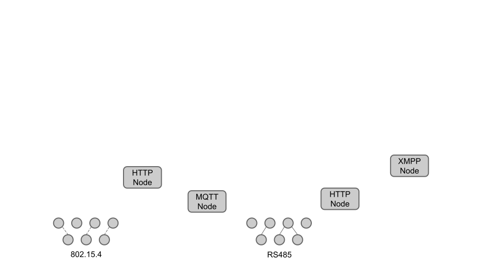
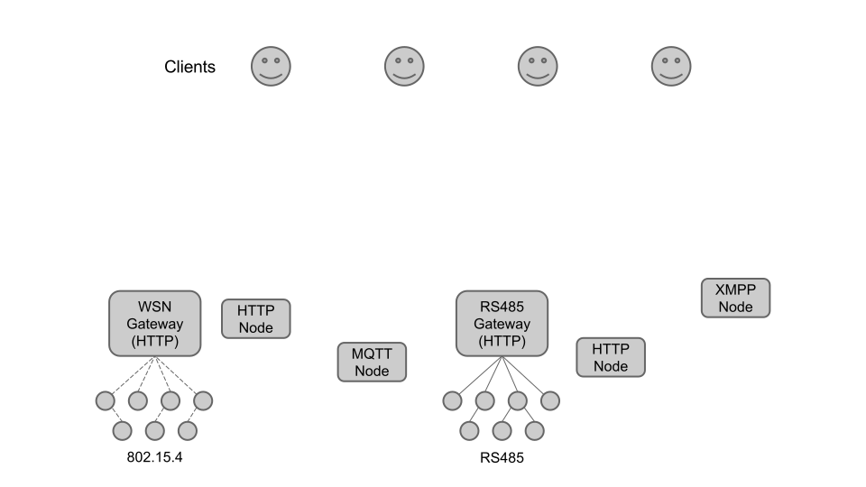
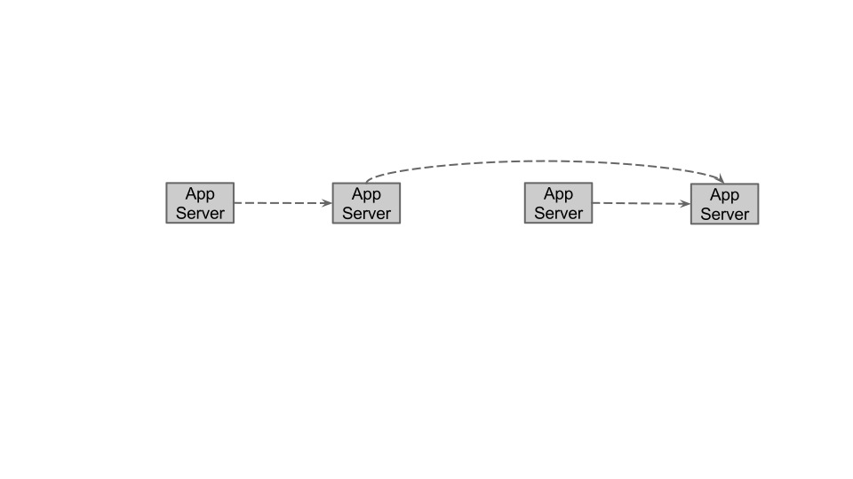
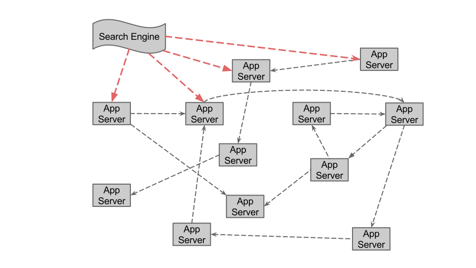

% Chain API
% Spencer Russell; MIT Media Lab
% 2014-10-06

---

## Vision

---

---

---

---

---

---

---

Link Oriented
-------------

* Links represent possible actions the client can take
    * Creating a device
    * Sending a command
* Hypermedia
* Built on json+hal

---

---

---

---

---

---

---

---

---

## Chain API

---

Streaming
---------

---

---

Open Source
-----------

[https://github.com/ssfrr/chain-api](https://github.com/ssfrr/chain-api)

Live
----

[http://chain-api.media.mit.edu](http://chain-api.media.mit.edu)

